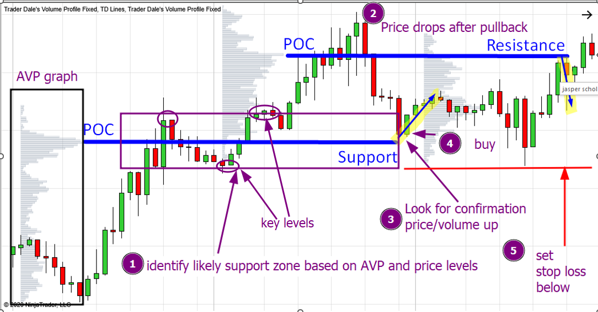

# 1. AVP indicator

## Why Indicators Matter in Trading
Indicators are essential tools for traders to understand price movements. One of the most useful is the **Volume Profile**, which shows where the most buying and selling have occurred.

## Why Trading Volume Matters
When a price level has high volume, it means many buyers and sellers agree it's a fair price. If the price returns to that level, traders may enter again, making it a potential trade entry or exit zone.

---
## Indicator 1: Anchored Volume Profile (AVP)
Unlike standard volume indicators, which display volume per time period, the **AVP** shows how much volume was traded at each price level. This helps traders spot key zones of interest.
### How to Read Anchored Volume Profile
- 📌 **Anchor Point** – Start the AVP from a key high, low, or event.  
- 📊 **Horizontal Bars** – Represent volume at specific price levels.  
- 🔴 **Point of Control (POC)** – The level with the highest volume.  
- 🔹 **High Volume Areas** – Represent strong interest from buyers and sellers, likely indicating support or resistance.

---
## Price Action Levels
Price action levels are key areas where price has reacted before. These include:
- ✅ **Support Level** – The price level where the price bounces up.  
- ✅ **Resistance Level** – The price level where the price is rejected downward.

This can be seen by reversal points in around a certain price where price bounce down or up.

### AVP + Price Action Levels = 🚀
🎯 **Best Trade Zones** = High-Volume Areas + Key Support or Resistance

If your high volume zone also has seen multiple reversal points, it provides stronger evedence that the price will go back to your high volume zone. Which you can use to react to

---
## Trading Strategy: Support Bounce
- 📌 **Scenario**: You notice a high-volume zone at $150 acting as support.
- 📉 Price drops toward $150 after a pullback.
- 👀 **Plan**: Look for confirmation that price or volume is increasing.
- 🎯 **Entry**: Buy near $150 when price holds.
- 📍 **Stop-Loss**: Set below the high-volume area (e.g., $147).
- 🚀 **Take Profit**: Target the next key resistance or high-volume zone.

---

## session volume profile
- used for day trading and lower time fame trading
- [scond part in depth vid](https://youtu.be/CrHdBH6yBJ8?list=PLX5YFA5MWM7kunAXyeiZm-KC9IXJM0cuh&t=237)

## Resources:
- [best trading indicators vid (0-5min)](https://www.youtube.com/watch?v=xv_Zwf1-8L8)
- [in depth vid](https://www.youtube.com/watch?v=CrHdBH6yBJ8&list=PLX5YFA5MWM7kunAXyeiZm-KC9IXJM0cuh)